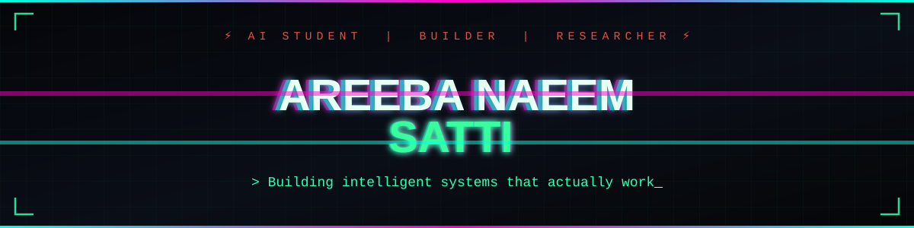

<div align="center">



</div>

<div align="center">

```
 █████╗ ██╗    ███████╗███╗   ██╗ ██████╗ ██╗███╗   ██╗███████╗███████╗██████╗ 
██╔══██╗██║    ██╔════╝████╗  ██║██╔════╝ ██║████╗  ██║██╔════╝██╔════╝██╔══██╗
███████║██║    █████╗  ██╔██╗ ██║██║  ███╗██║██╔██╗ ██║█████╗  █████╗  ██████╔╝
██╔══██║██║    ██╔══╝  ██║╚██╗██║██║   ██║██║██║╚██╗██║██╔══╝  ██╔══╝  ██╔══██╗
██║  ██║██║    ███████╗██║ ╚████║╚██████╔╝██║██║ ╚████║███████╗███████╗██║  ██║
╚═╝  ╚═╝╚═╝    ╚══════╝╚═╝  ╚═══╝ ╚═════╝ ╚═╝╚═╝  ╚═══╝╚══════╝╚══════╝╚═╝  ╚═╝
```

</div>

<div align="center">


</div>

<div align="center">


**🌐 [Portfolio](https://portfolio-areeba-naeem.vercel.app/) &nbsp;·&nbsp; 💼 [LinkedIn](https://www.linkedin.com/in/areebanaeemsatti001/)**

</div>

---

## About Me

Hi, I'm Areeba — a BS Artificial Intelligence student at Air University Islamabad, building AI systems that go from raw data to working product, not just notebooks. I bring hands-on industry experience from two internships at NASTP (National Aerospace Science & Technology Park), where I worked on real-world ML/DL solutions inside a national high-tech R&D environment. My focus spans Machine Learning, Computer Vision, NLP, and Generative AI — with a growing specialization in RAG pipelines and LLM-powered systems.

| | |
|---|---|
|  Currently exploring | **RAG · LLM Agents · MCP Fundamentals** |
|  Strong in | **ML/DL · Computer Vision · NLP** |
|  Data storytelling | **Power BI · Python · Plotly** |
|  Graph AI | **Neo4j · LangChain · Knowledge Graphs** |
|  Looking for | **AI/ML Opportunities & Research Collaborations** |

---
## Featured Projects

> Handcrafted AI & ML solutions built for real-world impact.

<table width="100%">
  <tr>
    <td width="50%" valign="top">
      <h3 align="center"><a href="https://github.com/Areebanaeemsatti/Medical-Tumor-Localization-Classification-with-YOLOv8">🧠 Medical Tumor Detection</a></h3>
      <p align="center">
        
        
      </p>
      <p>YOLOv8 & OpenCV object detection pipeline for identifying and classifying medical imaging tumors.</p>
      <p><code>YOLOv8</code> <code>OpenCV</code> <code>Python</code> <code>Deep Learning</code></p>
    </td>
    <td width="50%" valign="top">
      <h3 align="center"><a href="https://github.com/Areebanaeemsatti/Emotia">📓 Emotia: AI Diary</a></h3>
      <p align="center">
        
        
      </p>
      <p>Multi-label emotion classifier that maps complex emotional nuances from free-form diary text entries.</p>
      <p><code>NLP</code> <code>PyTorch</code> <code>Transformers</code> <code>Python</code></p>
    </td>
  </tr>
  <tr>
    <td width="50%" valign="top">
      <h3 align="center"><a href="https://github.com/Areebanaeemsatti/Quotes">🔍 Quote Explorer</a></h3>
      <p align="center">
        
        
      </p>
      <p>Semantic search engine that finds matching context quotes using dense vector embeddings.</p>
      <p><code>SBERT</code> <code>FAISS</code> <code>Vector Search</code> <code>Python</code></p>
    </td>
    <td width="50%" valign="top">
      <h3 align="center"><a href="https://github.com/Areebanaeemsatti/github-recommender">🕸️ GitHub Recommender</a></h3>
      <p align="center">
        
        
      </p>
      <p>Knowledge-graph recommendation engine mapping repository connections using LLM agents.</p>
      <p><code>Neo4j</code> <code>LangChain</code> <code>LLMs</code> <code>Python</code></p>
    </td>
  </tr>
  <tr>
    <td width="50%" valign="top">
      <h3 align="center"><a href="https://github.com/Areebanaeemsatti/AI_developer_productivity">⚙️ Dev Productivity Predictor</a></h3>
      <p align="center">
        
        
      </p>
      <p>Predicts developer productivity trends from activity telemetry data, deployed via a interactive Gradio UI.</p>
      <p><code>ML</code> <code>Gradio</code> <code>Scikit-Learn</code> <code>Python</code></p>
    </td>
    <td width="50%" valign="top">
      <h3 align="center"><a href="https://github.com/Areebanaeemsatti/Visualization_Orchestrator">📊 Visualization Orchestrator</a></h3>
      <p align="center">
        
        
      </p>
      <p>Multi-chart interactive dashboard tool for orchestrating and comparing complex datasets side by side.</p>
      <p><code>Dash</code> <code>Plotly</code> <code>Python</code> <code>Data Viz</code></p>
    </td>
  </tr>
</table>

---
## Tech Stack & Skills

**AI / ML**


**Generative AI & LLMs**


**Data & Visualization**


**Languages**


**Databases & Tools**


---

## Skills Proficiency

```
Machine Learning    ████████████████████░░  90%
Python              █████████████████████░░  92%
Data Analysis       ████████████████████░░░  85%
Deep Learning        ███████████████████░░░░  82%
Generative AI       ████████████████████░░░  80%
Computer Vision     ██████████████████░░░░░  78%
Power BI / Viz      ████████████████░░░░░░░  77%
NLP                 ███████████████░░░░░░░░  75%
```

---

## Roadmap & Directions

```
✅  ML & DL Foundations
    Supervised/unsupervised learning, model evaluation,
    feature engineering, classification & regression

✅  Computer Vision Pipelines
    YOLOv8 object detection, medical image preprocessing,
    CV feature extraction, OpenCV workflows

✅  NLP & Semantic Search
    N-gram models, BiLSTM, SBERT embeddings,
    FAISS vector search, multilingual classification

🔵  Generative AI & LLM Agents          ← Currently here
    RAG pipelines, LangChain agents, OpenAI APIs,
    knowledge graphs with Neo4j, MCP fundamentals

⬜  MLOps & Deployment                   ← Next
    Model serving, Docker, FastAPI, CI/CD for ML,
    monitoring & explainability

⬜  Research & Publications
    Contribute to AI research, publish papers,
    explore explainable ML & agentic systems at scale
```

---

## GitHub Activity & Stats

<div align="center">


</div>

<div align="center">


</div>

<div align="center">


</div>

---

## Connect With Me

<div align="center">

[](https://www.linkedin.com/in/areebanaeemsatti001/)
[](mailto:naeemsattiareeba@gmail.com)
[](https://github.com/Areebanaeemsatti)

</div>

---

<div align="center">


*"Building AI that helps, not just impresses."*

</div>
