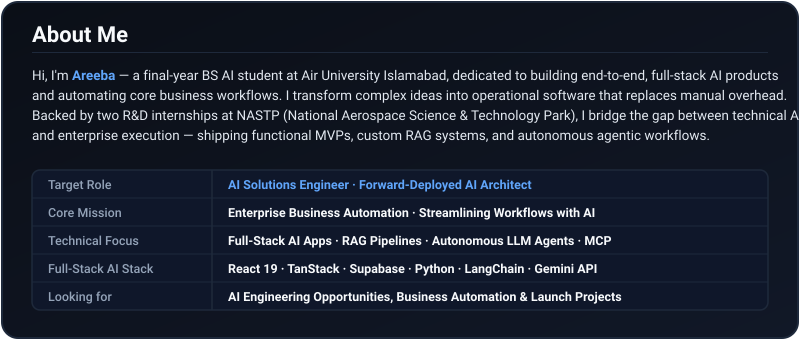
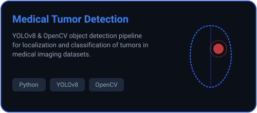
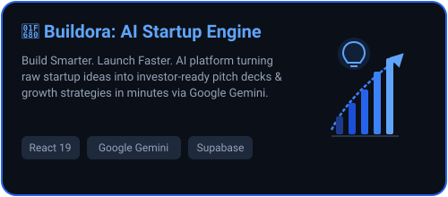
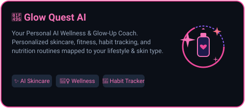
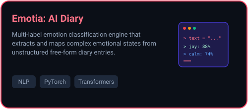
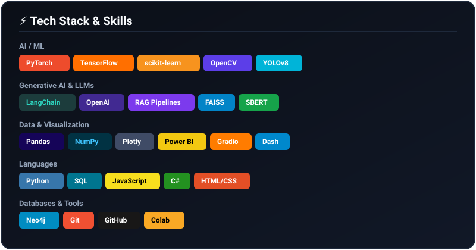
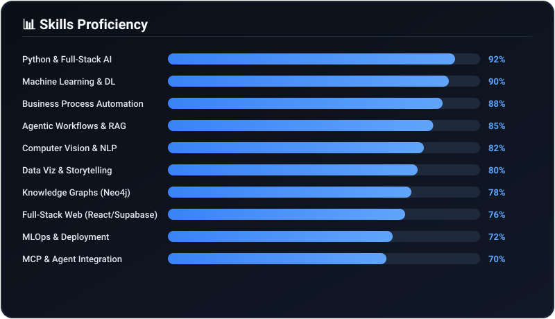
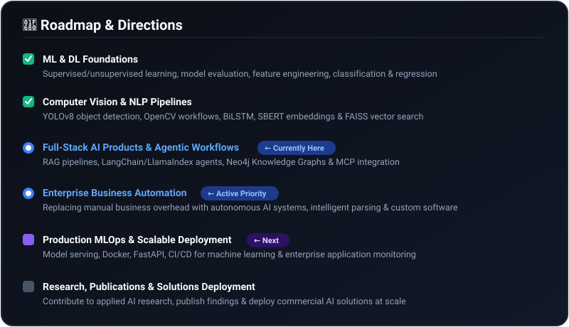
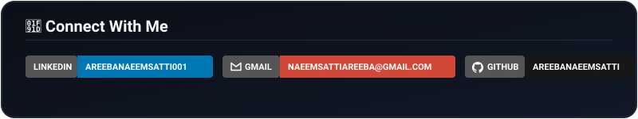
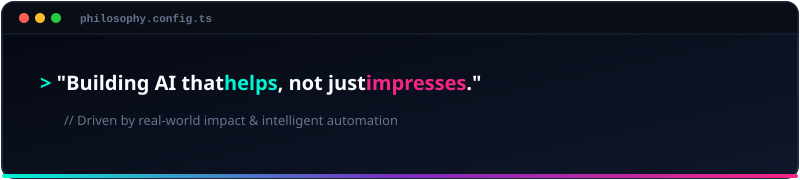

**🌐 [Portfolio](https://portfolio-areeba-naeem.vercel.app/) &nbsp;·&nbsp; 💼 [LinkedIn](https://www.linkedin.com/in/areebanaeemsatti001/)**

---

  

---
## Featured Projects

<table border="0" width="100%">
  <tr>
    <td width="50%" align="center">
      
    </td>
    <td width="50%" align="center">
      
    </td>
  </tr>
  <tr>
    <td width="50%" align="center">
      
    </td>
    <td width="50%" align="center">
      
    </td>
  </tr>
</table>
---

  

---

  

---

  

---

  
  

---

  

---

  

